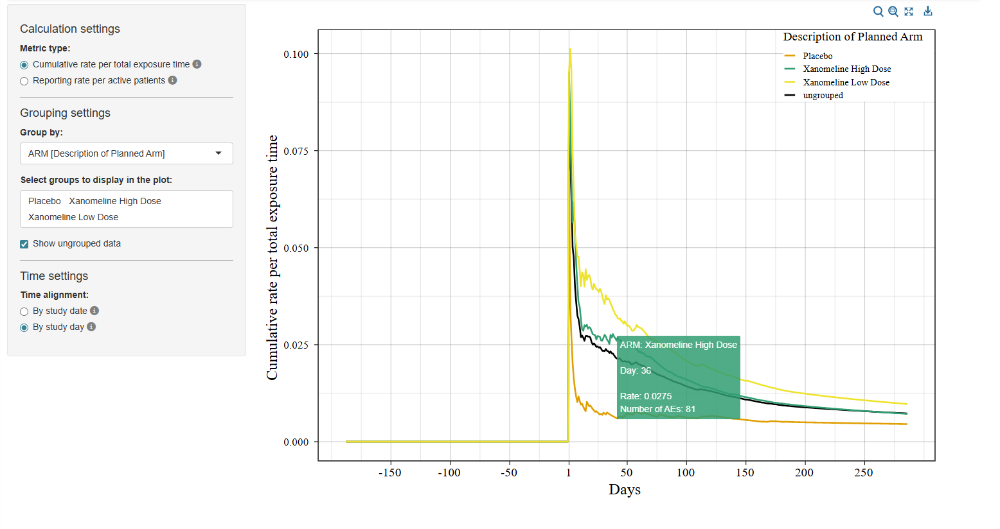

<!-- README.md is generated from README.Rmd. Please edit that file -->

```{r, include = FALSE}
knitr::opts_chunk$set(
  collapse = TRUE,
  comment = "#>",
  fig.path = "man/figures/README-",
  out.width = "100%"
)
```

# dv.reportrate

<!-- badges: start -->

<!-- badges: end -->

The {dv.reportrate} module computes and visualises adverse‑event‑derived reporting rates over time. It works with SDTM‑conformant datasets (DM, DS, AE) or similarly structured study‑specific datasets.



The interactive plot provides hovertext displaying detailed information for each data point. The module is designed to integrate seamlessly with the DaVinci {dv.manager} package and supports framework‑level features such as global filtering, study switching and bookmarking.

## Features

### Metrics

The module offers two metrics for quantifying adverse-event reporting behaviour over time:

-   **Cumulative rate per total exposure time**: a continuous cumulative measure of adverse events relative to total accumulated subject‑time. $$\text{crptt}(t) = \frac{\sum_{i=1}^N AE_i(t)}{\sum_{i=1}^N T_i(t)}$$

    Here, *AE~i~(t)* represents the number of adverse events reported for subject *i* from study start through day *t*, and *T~i~(t)* is the corresponding total observation time for subject *i.* The module shows this rate as a line plot.

-   **Reporting rate per active patients**: an interval‑based measure of events per actively observed patients (weekly or monthly).$$\text{rrpap}(a, b) = \frac{\sum_{i=1}^N AE_i(a,b)}{\sum_{i=1}^N I_i(b)}$$

    Here, *AE~i~(a, b)* is the number of events reported for subject *i* during the interval, and *I~i~(b)* indicates whether subject *i* was still being observed on day *b*. Users may choose weekly or monthly intervals. The module shows this rate as a step plot.

### Time alignment

Two options:

-   **By study date**: Calendar-based view aligned by actual dates. t~0~ corresponds to the earliest entry date across all subjects. Uses dates on the x-axis.

-   **By study day**: Subject-based view aligned to individual study timelines. t~0~ corresponds to each subject's individual study entry day. Uses study days on the x-axis.

### Grouping

Users may select any categorical variable from DM (or only those configured by the app creator) for grouping. Levels can be selected or deselected. Users can click a group-specific trace to highlight this group by dimming all other traces. Optionally, ungrouped data can be added. The module uses a colour-blind-friendly palette, if possible.

## Installation

``` r
if (!require("remotes")) install.packages("remotes")
remotes::install_github("Boehringer-Ingelheim/dv.reportrate")
```

## Example

{dv.reportrate} provides a mock function to launch the module with dummy data from the {pharmaversesdtm} R package for demonstration purposes:

``` r
dv.reportrate::mock_rr_app_with_mm()
```

To launch the module with your own data and configuration settings, add the module to your module list. An example how the module can be used is shown below:

``` r
library(dv.reportrate)
# Create a data list with example data
dm <- pharmaversesdtm::dm
ds <- pharmaversesdtm::ds
ae <- pharmaversesdtm::ae

data_list <- list(
   "dummy" = list(
      "dm" = dm, 
      "ds" = ds, 
      "ae" = ae
   )
)

# Preprocessing
data_list[["dummy"]]$ds <- data_list[["dummy"]]$ds |> dplyr::mutate(DSSTDTC = as.Date(.data[["DSSTDTC"]]))
data_list[["dummy"]]$ae <- data_list[["dummy"]]$ae |> dplyr::mutate(AESTDTC = as.Date(.data[["AESTDTC"]]))

# Specifying the module
reporting_rates <- mod_report_rates(module_id = "id_rr",
                                    dm_dataset_name = "dm",
                                    ds_dataset_name = "ds",
                                    ae_dataset_name = "ae",
                                    subjid_var = "USUBJID",
                                    tooltip_decimal_places = 4L,
                                    disposition_events = list(event_var = "DSDECOD",
                                                              date_var = "DSSTDTC",
                                                              day_var = "DSSTDY",
                                                              entry_vals = c("RANDOMIZED"),
                                                              exit_vals = c("COMPLETED", "WITHDRAWAL BY SUBJECT", "DEATH")),
                                    adverse_events = list(date_var = "AESTDTC", day_var = "AESTDY"),
                                    grouping_vars = list(choices = c("ARM", "ACTARM", "SEX", "SITEID"),
                                                         default_choice = "ARM"),
                                    x_step_size_list = list(days = 50L, weeks = 2L, months = 1L))

# Launching the DaVinci app
dv.manager::run_app(
    data = data_list,
    module_list = list(
      "Reporting Rates" = reporting_rates
    ),
    filter_data = "dm",
    filter_key = "USUBJID"
)
```

The module expects 3 datasets:

-   A demographics dataset (e.g. `dm`) including variables containing the following information:

    -   Unique subject identifier (e.g. `USUBJID`).

    -   (optional) Factor variables (e.g `ARM`) that can be used for grouping.

    The set of variables can be limited by providing a character vector (e.g. `c("ACTARM", "SEX")`) to the `grouping_vars$choices` parameter. App creators may also define a default grouping variable that is used when starting the app by supplying it to `grouping_vars$default_choice`.

-   A dispositions dataset (e.g. `ds`) including variables containing the following information:

    -   Event description (e.g. `DSDECOD`) used to classify entry and exit events based on the values specified in `disposition_events$entry_vals` and `disposition_events$exit_vals`.

    -   Event date (e.g. `DSSTDTC`) on which the disposition event occurred.

    -   Numeric study day of event (e.g. `DSSTDY`).

-   An adverse events dataset (e.g. `ae`) including variables containing the following information:

    -   Event date (e.g. `AESTDTC`) on which the adverse event started.

    -   Numeric study day of the event (e.g. `AESTDY`).
